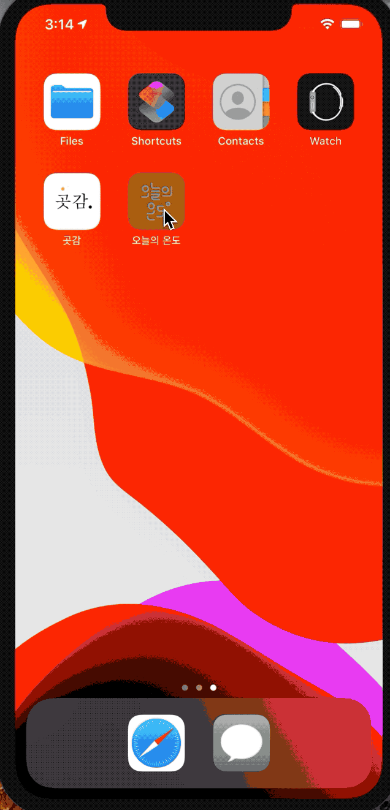
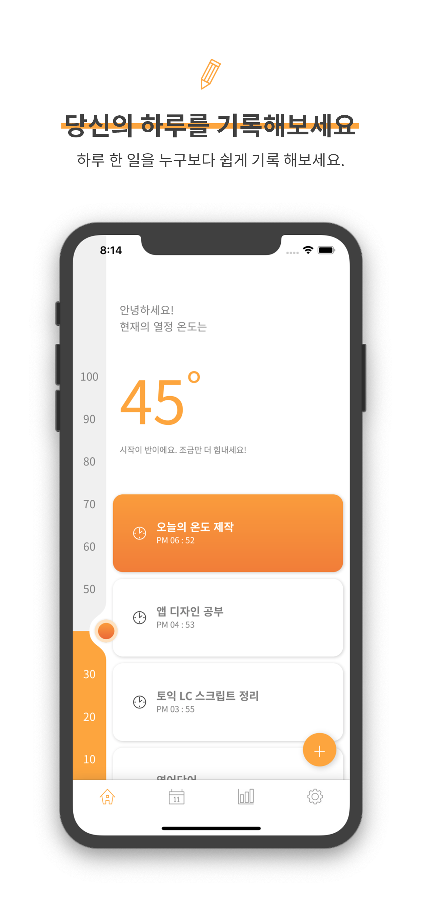
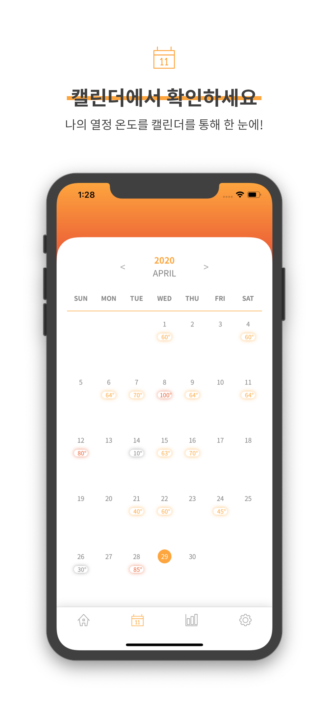
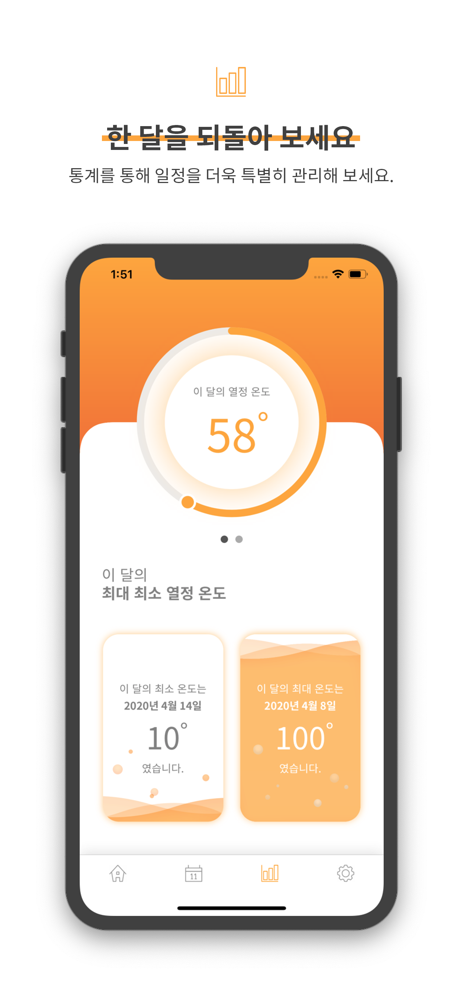
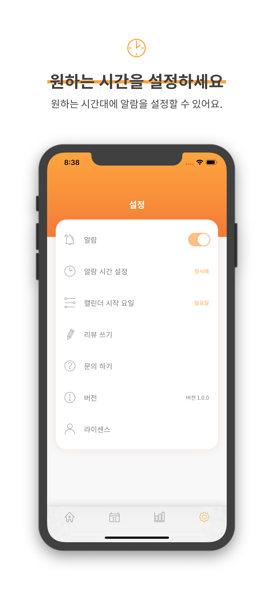

🚨 Woong, iOS Developer 가 되고싶어요 🙏🙏🙏

# Me

- 최철웅
- Born is 1993.10.21
- Email: ccw1021.dev@gmail.com
- Blog: https://woongsios.tistory.com
- [github](https://github.com/chelwoong/)
- [BOJ](https://www.acmicpc.net/user/woongs)

# Career

- 티티고, 인턴 (2019.02 ~ 2019.12)
- 명지대학교 컴퓨터공학과 졸업 (2013 ~ 2020)

# Project

### iOS

**[곳감](https://github.com/YAPP-16th/Team_iOS_1_Client)** (2020.02 ~ 진행 중)
- 소개: 위치 기반 알림 서비스
- 담당부분: MVVM 구조설계, 맵, 목록, 알림, 할 일 생성 담당
- 개발언어 및 사용기술: Swift, MVVM, RxSwift, RxCocoa, RxDataSources

**[오늘의 온도](https://apps.apple.com/us/app/%EC%98%A4%EB%8A%98%EC%9D%98-%EC%98%A8%EB%8F%84/id1510706558?ls=1)** (2020.01 ~ 2020.05)
- 소개: 할 일이 아닌 한 일에 초점을 맞춰 기록해 얼마나 살고 있는 확인하도록 도와주는 어플리케이션
- 담당부분: Personal Develop
- 개발언어 및 사용기술: Swift, Core Data
- 결과
  - 앱스토어 출시

 

**[WSMessenger](https://github.com/chelwoong/WSMessanger)** (2019.09 ~ 12)
- 소개: 메신저 앱, Firebase의 인증과 DB 사용, Realm을 사용해 로컬 DB에도 저장해서 관리
- 담당부분: Personal Develop
- 개발언어 및 사용기술: Swift, Firebase, Messagekit (open source), realm
- 결과
  - Firebase Auth, FireStore 사용
  - Messagekit 오픈소스 사용, 메세지 복사, 삭제 구현 
  - Realm 사용
  - Contacts 사용

**[Swift 30 Project](https://github.com/chelwoong/Swift-30-Projects)** (2019.04 ~ 2019.09)

- 소개: 각각 다른 주제르 가진 토이 프로젝트 30개 만들어보기  
- 담당부분: Personal Develop (Brian Voong 강좌)
- 경험
  - Stroyboard, Code base
  - Foundation(Timer, Calendar 등)
  - UIKit (UITableView, UICollectionView, … 등)
  - AVFoundation
  - Mapkit
  - Animation  
  (하나의 프로젝트를 제대로 완성하는 것이 더 중요하다고 판단해 중간에 스탑했습니다.)

**[YoutubeClone](https://github.com/chelwoong/YoutubeClone)** (2019.01 ~ 02)

- 소개: Youtube 구현하기
- 개발언어: Swift,
- 담당부분: Personal Develop (Brian Voong 강좌)

**[BoxOffice](https://github.com/chelwoong/BoxOffice)** (2018.12)

- 소개: 영화 소개 Application, JSON 포맷 데이터를 받아 Collection View, Table View로 영화의 정보들을 볼 수 있는 App
- 개발언어: Swift
- 담당부분: Personal Develop (부스트캠프 3기 사전과제)
- 경험 
  - 대표적인 두 가지 뷰 활용 및 흔히 볼 수 있는 UI 구현에 대한 고민
  - 여러 UI 제공된 API를 사용하면서 Thread 처리에 대한 이해
  - 네트워크 동작시 Indicator 활용 등 사용자 UX에 대한 고민
  - '구현'에 초점을 맞추다보니 강제 캐스팅 남발(?)등 좋은 코드로 '잘' 짜는 것에 대한 고민 부족

**[WoongTalk](https://github.com/chelwoong/WoongTalk)** (2018.11)

- 소개: 채팅 앱
- 개발언어: Swift, Snapkit, Object Mapper, Firebase
- 담당부분: Personal Develop (Howl 강좌)
- 경험 
  - CocoaPod를 활용해 SnapKit, Object Mapper, Firbase 등 프레임워크 사용기회
  - Apple의 iOS 개발 가이드라인을 잘 지키며 구현하는 개발이 아니었지만 처음으로 뭔가 만들 수 있겠구나 라는 자신감과 흥미를 가질 수 있었던 경험

### Other

**[Lost-Found](https://github.com/merturl/Lost-Found)** (2017.12)

- 소개: 잃어버린 물건 찾아주기 앱
- 담당부분: 전체적 UI 및 Firebase를 활용해 geofence기반 마커관리
- 개발언어: Android, Firebase
- 간단한 학점계산기 (2018.05)

**[AR-Funiture](https://github.com/chelwoong/grade_calculator)** (2018.04 ~ 2018.06)

- 소개: 마커기반 AR 가구 렌더링 프로젝트
- 담당부분: 전체적인 UI
- 개발언어: React, AR.js, DeepLearning

**[Vote_lottery](https://github.com/sleak434/vote_lottery)** (2018.07)

- 블록체인
**[Time_Manager](https://github.com/chelwoong/Time_Manager)** (2018.9)

- 소개: 근무시간 기록 프로그램
- 담당부분: 전체 서비스 개발
- 개발언어: Javascript, Chrome extention
- [웹스토어 보러가기](https://chrome.google.com/webstore/detail/time-manager/fkeblohjdefejdpegoclmhcllgkdlflh?hl=ko)

**Cafe With** (Private Stroage) (2018.07 ~ 2018.10)

- 소개: 빈 자리가 있는 카페를 찾아주는 어플리케이션
- 담당부분: Front-End 담당
- 개발언어: React Native, AWS, Node.Js

# Experience

- [YAPP 16기](https://github.com/YAPP-16th) (2020.02 ~ )
- 우정사업본부 빅데이터 2018 해커톤 참가 (2018.12)
- BlockChain Developer Bootcamp, 1st (2018.07.05~07)
